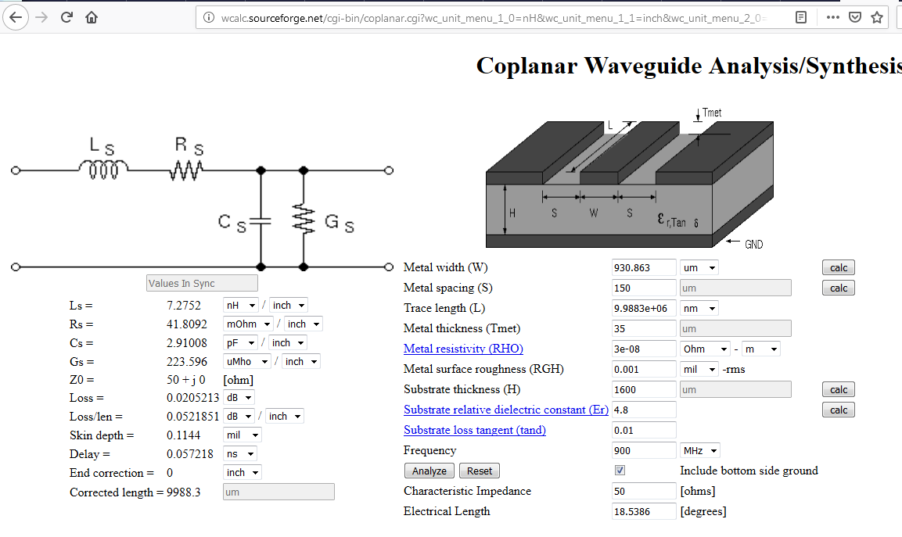

Wellenwiderstand berechnen
============================

Ziel ist es, für einen GPS Empfänger den Wellenwiderstand der Leiterbahn zum 
Anschluss der Antenne zu berechnen. Wenn der Wellenwiderstand nicht stimmt, 
kommt es zu Leistungsverlust und somit zu Signal/Qualitätseinbusen.

Vorgaben:

* Frequenz: 1575 MHz
* Impedanz: 50 Ohm
* PCB: FR4, 1.5 mm, 2 Lagen

Berechnung mit Online-Tool
-----------------------------

siehe:

1. http://wcalc.sourceforge.net/cgi-wcalc.html
#. http://wcalc.sourceforge.net/cgi-bin/coplanar.cgi
#. http://wcalc.sourceforge.net/cgi-bin/microstrip.cgi

Berechnungen gemäss 2.:

1. Leiterbahnbreite (W): 0.930 mm
#. Abstand zum GND-Plane (S): 0.150 mm
#. Cu-Dicke (Tmet): 35 um
#. Printdicke (T) 1.600 mm
#. Er (FR4): 4.8

Wellenwiderstand ausmessen
------------------------------

Verwende vnaJ.3.2.10 mit miniVNA Tiny.

siehe: https://www.wimo.com/minivna-network-analyser_2_d.html

Weitere Links:
----------------

siehe: 

1. https://www.multi-circuit-boards.eu/leiterplatten-design-hilfe/impedanzkalkulation.html
#. http://www.saturnpcb.com/pcb_toolkit/
#. https://www.we-online.de/web/de/index.php/show/media/04_leiterplatte/2014_1/webinare_2/starrflex_2/Webinar_Vorteile_Starrflex.pdf
#. https://www.broadcom.com/appcad

Webinar_Vorteile_Starrflex.pdf

aus 1. 

