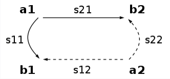

NVA Grundlagen
=================

S-Parameter (Streuparameter)
-----------------------------

:S11: Eingangsreflexion Anpassung des Eingangs. Wie gut (bzw. schlecht) ist der 
      Eingang an mein Referenzsystem (50 Ohm oder 75 Ohm) angepasst. 
      Ein betragsmäßig niedriger Wert sagt aus, dass ein Eingangssignal kaum 
      reflektiert wird.
:S21: Vorwärtstransmission Verstärkung/Dämpfung des Eingangssignals. Bei einem 
      Verstärker gibt S21 die Verstärkung an. Bei einem passiven Element die 
      Einfügedämpfung.
:S12: Rückwärtstransmission sollte bei passiven bidirektionalen Elementen S21 
      entsprechen.
:S22: Ausgangsreflexionsfaktor Anpassung des Ausgangs. Wie gut (bzw. schlecht) 
      ist der Ausgang an mein Referenzsystem (50 Ohm oder 75 Ohm) angepasst. 
      Bei schlechter Anpassung wird die Ausgangsleistung schon am Ausgang 
      reflektiert.

:math:`\frac{ \sum_{t=0}^{N}f(t,k) }{N}`

Links
-------

* https://de.wikipedia.org/wiki/Streuparameter
* https://www.darc.de/fileadmin/_migrated/content_uploads/Vortrag_Vektorieller_Network-Analyser.pdf
* http://docutils.sourceforge.net/docs/ref/rst/directives.html#math
* https://stackoverflow.com/questions/3610551/math-in-restructuredtext-with-latex