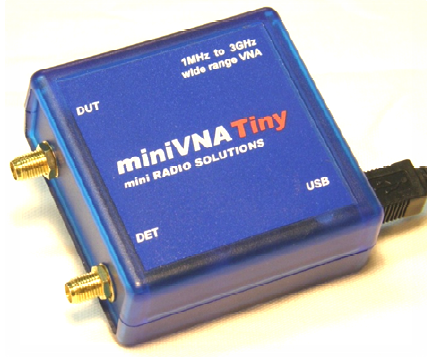

Artikel zum miniVNA tiny
============================

Übersicht
-------------

Anschlüsse HF-Seite
.....................

**ACHTUNG** An DET und DUT Keine Gleichspannungen über 25V und keine HF-Signale 
über 10mW zuführen (erlöschen der Garantie)!

DUT
~~~~~~

Der DUT-Port ("device under test") wird in der Regel mit der zu messenden 
Antenne verbunden, wenn der Analysator von der Software auf "Reflection-Mode" 
eingestellt wird. 

DET
~~~~ 

Der DET-Port ("Detektor") wird verwendet, um Filter und Verstärker zu überprüfen, 
wenn der Analysator von der Software auf 'Transmission-Mode' eingestellt wird.

Technische Daten
..................

* Frequenzbereich 1-3000 MHz
* Kalibrierung mit open/short/50 Ohm für genaue Ergebnisse (separat bestellen!)
* Meßbereich Z 1-1000 Ohm
* Zwei-Port VNA der S11 und S21 messen, anzeigen und die Ergebnisse speichern kann
* HF-Generator mit einer Ausgangsleistung von -6dBm bei 500 MHz
* SMA-Anschlüsse für bessere Isolation
* Dynamikbereich bis zu 70 dB bei 500 MHz
* Geringer Stromverbrauch, 370mA bei 5 V
* Boot-Loader für zukünftige Firmware-Upgrades
* Benutzerfreundliche Schnittstelle für PC: Windows, Linux und Mac
* Android-Handy-Software
* Integrierte Smith-Diagramme in der Software
* Datenexport in verschiedenen Formaten - JPEG, EXCEL, ZPLOT, S2P, PDF

Softwaredoenload
...................

https://vnaj.dl2sba.com/

Was ist der mini VNA tiny
...........................

Was kann der mini VNA tiny
...........................

Artikel zum miniVNA tiny
---------------------------

.. toctree::
   :maxdepth: 1
   :caption: Contents:
   
   NVA_Grundlagen.rst

Links
--------

* http://miniradiosolutions.com/54-2/
* https://www.wimo.com/minivna-network-analyser_2_d.html
* https://www.darc.de/fileadmin/_migrated/content_uploads/Vortrag_Vektorieller_Network-Analyser.pdf

